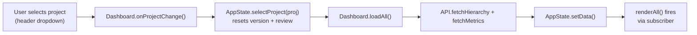
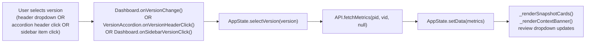
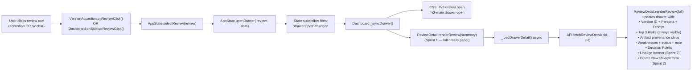

# Application Flow

**Project Delivery Accelerator Engine — V2 End-to-End Application Flow**

> This document maps the complete runtime flow from server startup through user interactions. Each node references a real file and function.

---

## Linked Components

| Step | File | Function |
|------|------|----------|
| Server startup | `server.py` | `main()`, `_parse_args()` |
| UI version resolution | `server.py` | `_resolve_ui_version()` |
| HTML load | `static/v2/dashboard_v2.html` | — |
| App bootstrap | `static/v2/js/dashboard.js` | `Dashboard.init()` |
| Project fetch | `static/v2/js/api.js` | `API.fetchProjects()` |
| Hierarchy fetch | `static/v2/js/api.js` | `API.fetchHierarchy()` |
| Metrics fetch | `static/v2/js/api.js` | `API.fetchMetrics()` |
| State update | `static/v2/js/state.js` | `AppState.setData()` |
| Full render | `static/v2/js/dashboard.js` | `Dashboard.renderAll()` |
| Accordion render | `static/v2/js/accordion.js` | `VersionAccordion.render()` |
| Card render | `ui/v2/components/Cards.js` | `Cards.render()` |
| Review drawer render | `static/v2/js/review_detail.js` | `ReviewDetail.renderReview()` *(Sprint 1)* |
| Weakness note persist | `static/v2/js/api.js` | `API.updateWeaknessNote()` *(Sprint 1)* |
| Weakness status persist | `static/v2/js/api.js` | `API.updateWeaknessStatus()` *(Sprint 1)* |
| Review iteration toggle | `static/v2/js/review_detail.js` | `ReviewDetail.onToggleIterationForm()` *(Sprint 2)* |
| Review iteration submit | `static/v2/js/review_detail.js` | `ReviewDetail.onCreateIteration()` *(Sprint 2)* |
| Review iteration API call | `static/v2/js/api.js` | `API.createReviewIteration()` *(Sprint 2)* |

---

## Startup and Bootstrap Flow

```mermaid
flowchart TD
    A([python server.py]) --> B["_parse_args()<br/>--ui v1|v2"]
    B --> C["UI_VERSION = 'v1' or 'v2'<br/>(module-level constant)"]
    C --> D["HTTPServer starts<br/>HOST:PORT"]
    D --> E["Browser GET /"]
    E --> F{"_resolve_ui_version()<br/>?ui= param OR flag"}
    F -->|v2| G["_serve_static('v2/dashboard_v2.html')"]
    F -->|v1| H["_serve_static('index.html')"]
    G --> I["Browser parses HTML<br/>loads CSS + JS in order"]
    I --> J["DOMContentLoaded fires<br/>Dashboard.init()"]
    J --> K["API.fetchProjects()"]
    K --> L{"Projects returned?"}
    L -->|yes| M["AppState.selectProject(projects[0])"]
    L -->|no (error)| N["Show empty state"]
    M --> O["Dashboard.loadAll()"]
    O --> P["Promise.all: fetchHierarchy + fetchMetrics"]
    P --> Q["AppState.setData(hierarchy, metrics, versions)"]
    Q --> R["State subscribers fire"]
    R --> S["Dashboard.renderAll()"]
    S --> T["_renderSnapshotCards()"]
    S --> U["VersionAccordion.render()"]
    S --> V["_renderSidebar()"]
    S --> W["_populateVersionDropdown()"]
    S --> X["_populateReviewDropdown()"]
```

---

## User Interaction Flows

### Project Selection Loop



### Version Selection Loop



### Review Selection + Drawer Open Loop



> **Sprint 1:** `ReviewDetail` (`static/v2/js/review_detail.js`) is the primary drawer renderer for reviews. It is aliased as `window.DetailPanel` for backward compatibility. Compare remains a secondary explicit button action — it does **not** open on review click.

### Review Iteration Flow (Sprint 2)

```mermaid
flowchart LR
    I1["User opens Review<br/>Full Details drawer"] --> I2["ReviewDetail.renderReview(r)<br/>renders lineage banner if<br/>previous_review_id present"]
    I2 --> I3["User clicks<br/>'New Iteration' button"]
    I3 --> I4["onToggleIterationForm(rid)<br/>reveals iteration form<br/>(explicit user action only)"]
    I4 --> I5["User selects persona<br/>(same or different)<br/>+ optional custom prompt"]
    I5 --> I6["User clicks<br/>'Create New Review'"]
    I6 --> I7["onCreateIteration(btn)<br/>collects persona + prompt"]
    I7 --> I8["API.createReviewIteration(pid, rid,<br/>newPersona, customPrompt)"]
    I8 --> I9["POST /hierarchy/reviews/{rid}/iterate"]
    I9 --> I10["handle_create_review_iteration()<br/>handlers/review.py"]
    I10 --> I11["create_review_iteration()<br/>services/review.py"]
    I11 --> I12["store.create_review()<br/>previous_review_id = rid<br/>persona = new or base<br/>artifact_refs = base refs"]
    I12 --> I13["Returns new review summary<br/>review_id, persona_used,<br/>previous_review_id, persona_changed"]
    I13 --> I14["_renderIterationResult(result)<br/>confirmation card in drawer<br/>shows new ID + lineage"]
```



> **Sprint 2 rules:**
> - The original review is **never modified**. A new review is always created.
> - Persona selection is **optional** — defaults to base review persona when omitted.
> - Base review becomes **context input** for the new review execution.
> - Open decision points from the base review are **carried forward** into the new review.

### Refresh Loop (no page reload)

```mermaid
flowchart LR
    RF1["User clicks ↺ Refresh"] --> RF2["Dashboard.onRefresh()"]
    RF2 --> RF3["_toast('Refreshing…')"]
    RF3 --> RF4["Dashboard.loadAll(silent=false)"]
    RF4 --> RF5["AppState.set('loading', true)"]
    RF5 --> RF6["Promise.all: fetchHierarchy + fetchMetrics"]
    RF6 --> RF7["AppState.setData(new data)"]
    RF7 --> RF8["AppState.set('loading', false)"]
    RF8 --> RF9["All subscribers re-render<br/>with fresh data"]
    RF9 --> RF10["_renderLastUpdated(timestamp)"]
```



---

## Full Application State Machine

```mermaid
stateDiagram-v2
    [*] --> Loading: Dashboard.init()
    Loading --> NoProject: projects = []
    Loading --> ProjectSelected: selectProject(p)

    NoProject --> ProjectSelected: user creates project (v1 tab)

    ProjectSelected --> DataLoaded: loadAll() resolves
    DataLoaded --> VersionSelected: selectVersion(v)
    DataLoaded --> DataLoaded: onRefresh()

    VersionSelected --> ReviewSelected: selectReview(r)
    VersionSelected --> VersionSelected: onVersionChange()

    ReviewSelected --> DrawerOpen: openDrawer('review', r)
    ReviewSelected --> ReviewSelected: onReviewChange() → metrics refresh

    DrawerOpen --> ReviewSelected: closeDrawer()
    DrawerOpen --> DrawerOpen: fetchReviewDetail() resolves → update content
    DrawerOpen --> IterationFormOpen: user clicks 'New Iteration' button *(Sprint 2)*
    IterationFormOpen --> DrawerOpen: user cancels form
    IterationFormOpen --> IterationCreated: onCreateIteration() → POST /iterate
    IterationCreated --> DrawerOpen: result card shown; user refreshes list
```


