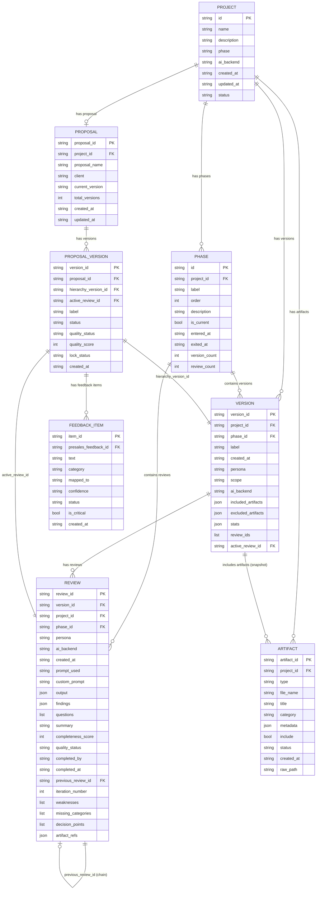
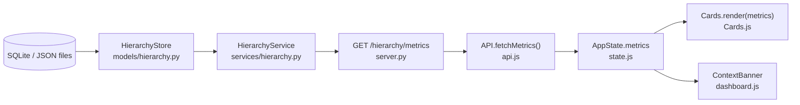

# Data Model

**Project Delivery Accelerator Engine — Core Entity Model**

> This document defines the data entities, their attributes, foreign key relationships, and storage locations. All entities map directly to Python dataclasses in `models/hierarchy.py`.

---

## Linked Components

| Entity | Model File | Store File |
|--------|-----------|------------|
| Project | `models/project.py` | `services/project.py` |
| Phase | `models/hierarchy.py` → `Phase` | `models/hierarchy.py` → `HierarchyStore` |
| Version | `models/hierarchy.py` → `Version` | `models/hierarchy.py` → `HierarchyStore` |
| Review | `models/hierarchy.py` → `Review` | `models/hierarchy.py` → `HierarchyStore` |
| Artifact | `models/artifact.py` → `Artifact` | `processors/artifact_store.py` |
| Proposal | `models/proposal.py` → `ProposalTracker` | `services/proposal.py` |
| FeedbackItem | `models/proposal.py` → `FeedbackItem` | `services/presales.py` |

---

## Entity Relationship Diagram



---

## Entity Descriptions

### Project
Top-level entity. One project = one client engagement or assessment context.  
**Storage:** `projects_data/projects.json` + `accelerator.db → projects table`

### Phase
Lifecycle stage within a project. Standard phases: `pre-sales → design → delivery → support`.  
Only one phase is `is_current` at a time. Phase transitions are recorded with timestamps.  
**Storage:** `projects_data/{pid}/hierarchy/phases.json`

### Version
A snapshot of the project state at a point in time. Contains the set of included artifacts, persona, scope text, and AI backend used. Versions are immutable once created.  
**ID format:** `v1`, `v2`, `v3` … (sequential within project)  
**Storage:** `projects_data/{pid}/hierarchy/versions/{vid}.json`

### Review
An execution run against a Version. Contains the prompt used, AI-generated output, structured findings (risks, constraints, dependencies, assumptions, action_items, gaps), questions, weaknesses, and decision points.  
**ID format:** `r1`, `r2`, `r3` … (sequential within project)  
**Iteration number:** 1-based per version (R1, R2 … within V1)  
**Storage:** `projects_data/{pid}/hierarchy/reviews/{rid}.json`

**Sprint 1 additions (backward-compatible):**
- `artifact_refs[]` — structured provenance references. Each entry: `{artifact_id, artifact_name, artifact_type, section_reference, page_reference, slide_number, slide_title, subject, date, sender, meeting_name, timestamp, sheet, row_range, excerpt}`. Types: `document | slides | email | meeting_notes | spreadsheet`. Defaults to `[]` for existing records.
- `weakness.user_note` — optional free-text note stored within each weakness dict alongside `status`. Defaults to `""` when absent.

**Sprint 2 additions (backward-compatible):**
- `previous_review_id` — FK to the review this was iterated from. Empty string `""` for original (non-iterated) reviews. Enables lineage traversal and diff computation. Existing records default to `""` — no migration required (column already existed from S1).
- Review iteration is always **user-initiated**: no auto-chaining. The original review is never modified. Each iteration stores its own `prompt_used`, `persona`, and `created_at`.

**Review iteration lineage schema (Sprint 2):**

```json
{
  "review_id":          "r4",
  "version_id":         "v2",
  "previous_review_id": "r3",
  "iteration_number":   2,
  "persona":            "Delivery Manager",
  "prompt_used":        "Refined delivery risks…",
  "created_at":         "2026-06-01T10:00:00Z"
}
```

**Weakness schema (Sprint 1):**

```json
{
  "id": "w1",
  "text": "Weakness description",
  "category": "risks",
  "status": "open",
  "user_note": "Optional free-text annotation by the user"
}
```

**Artifact reference schema (Sprint 1):**

```json
{
  "artifact_id": "a1",
  "artifact_name": "Solution_Architecture.docx",
  "artifact_type": "document",
  "section_reference": "Technical Assumptions",
  "page_reference": "7",
  "excerpt": "Optional short excerpt"
}
```

### Artifact
An ingested document (uploaded file or pasted text). Linked to a project and optionally included in a Version snapshot.  
**Categories:** `project_artefact`, `meetings_comms`, `delivery_notes`, `client_context`, `architecture_design`, `external_data`  
**Storage:** `projects_data/{pid}/artifacts/artifacts.json` + raw files in `projects_data/{pid}/raw/`

### Proposal / ProposalVersion
Tracks client-facing proposal documents. Each `ProposalVersion` is hard-linked to a `Version` and its `active_review_id` for full traceability.

### FeedbackItem
Atomic unit of structured client feedback. Classified into: `accepted`, `rejected`, `change_requested`, `concerns`. Auto-flagged as `is_critical` when mapped to `scope_change` or `risk`.

---

## Key Relationship Rules

| Rule | Detail |
|------|--------|
| Project → Phase | Standard phases always exist; counts are maintained on each phase |
| Phase → Version | `phase_id` FK on Version; set to `current_phase` at version creation time |
| Version → Review | `review_ids: List[str]` on Version; `version_id` FK on Review |
| Version active review | `active_review_id` — validated against `review_ids`; defaults to latest |
| Review chain | `previous_review_id` links iterations; `iteration_number` is 1-based per version |
| Review iteration | `previous_review_id` is user-selected, never automatic; original review is immutable *(Sprint 2)* |
| ProposalVersion traceability | Both `hierarchy_version_id` and `active_review_id` are required (DS-02 gate) |
| Review provenance | `artifact_refs[]` links review findings back to source artifacts (Sprint 1) |
| Weakness annotation | `weakness.user_note` persists free-text user annotation alongside `weakness.status` (Sprint 1) |

---

## V2 Dashboard Data Flow



**Data shape at each boundary:**

| Boundary | Shape |
|----------|-------|
| HierarchyStore → Service | `Version` + `Review` dataclass objects |
| Service → Handler | Python `dict` |
| Handler → HTTP | `JSON` string |
| HTTP → API module | Parsed `object` (JS) |
| API module → AppState | `MetricsPayload` object |
| AppState → Cards | `MetricsPayload` (same object, no copy) |
