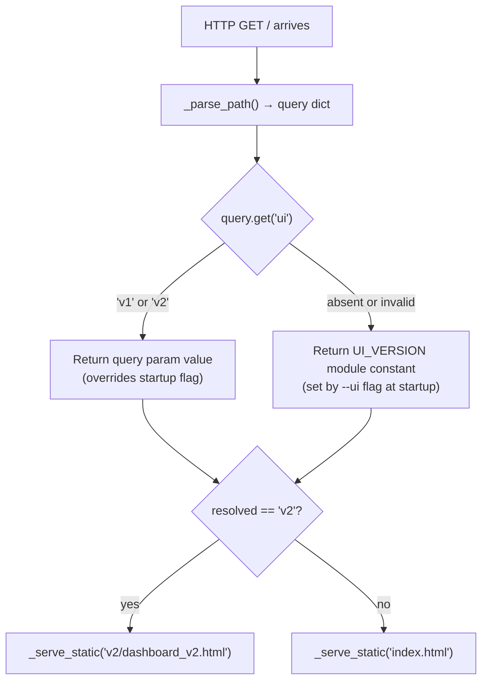
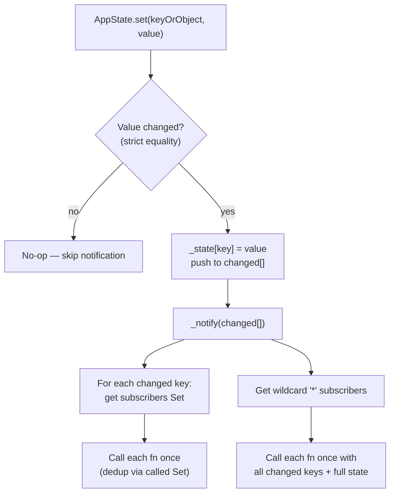
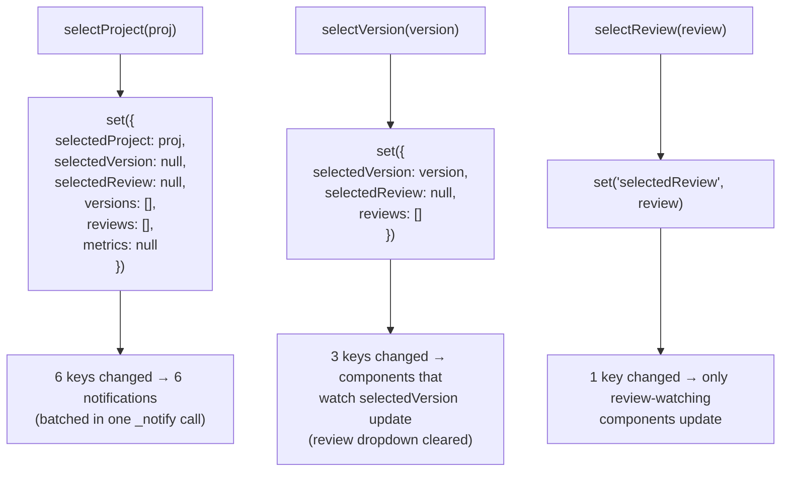
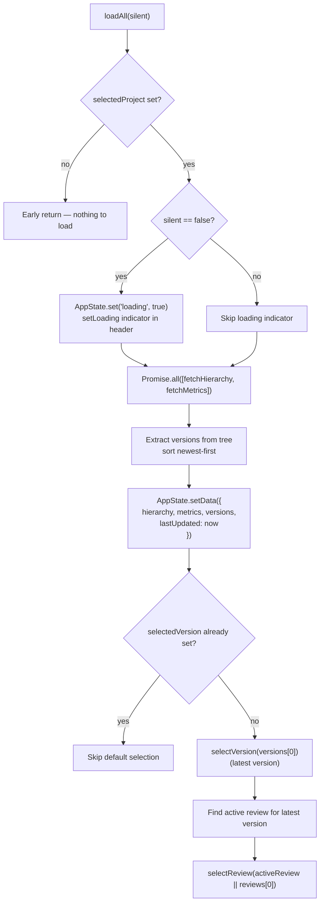
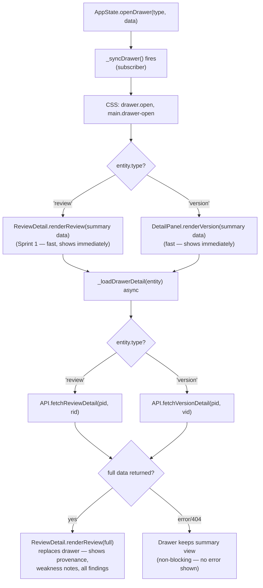
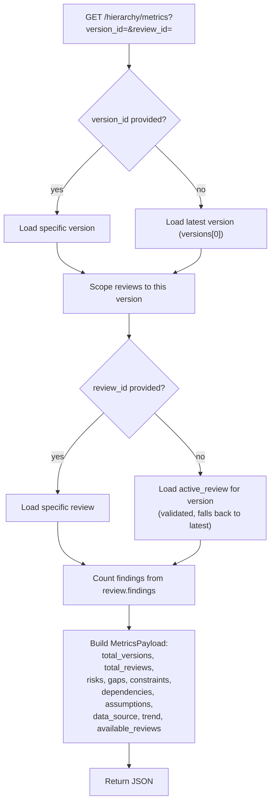
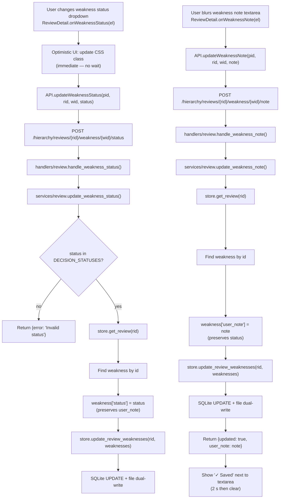

# Logic Flow

**Project Delivery Accelerator Engine — V2 Internal Logic Flow**

> This document maps the decision logic, branching conditions, and data transformation steps within each layer. Covers mock/live switching, state notification, cascade resets, and drawer loading.

---

## Linked Components

| Logic Area | File | Key Functions |
|------------|------|---------------|
| UI version resolution | `server.py` | `_resolve_ui_version()` |
| Mock/live API switch | `static/v2/js/api.js` | `_useMock()`, all fetch functions |
| State notification | `static/v2/js/state.js` | `_notify()`, `set()`, `subscribe()` |
| Cascade resets | `static/v2/js/state.js` | `selectProject()`, `selectVersion()` |
| Data load decision | `static/v2/js/dashboard.js` | `loadAll()`, `onVersionChange()` |
| Drawer load | `static/v2/js/dashboard.js` | `_loadDrawerDetail()` |
| Accordion expand | `static/v2/js/accordion.js` | `onVersionHeaderClick()` |
| Metrics scope | `services/hierarchy.py` | `get_metrics()` |

---

## 1. UI Version Resolution Logic



**Decision point:** Query param always wins. This allows `?ui=v2` to load v2 even when server started with `--ui v1`.

---

## 2. API Mock / Live Switch Logic

```mermaid
flowchart TD
    A["API.fetchXxx() called"] --> B{"window.V2_USE_MOCK !== false?"}
    B -->|true (default)| C["Return MOCK_DATA constant<br/>No HTTP call made<br/>Instant, deterministic"]
    B -->|false (Step 2)| D["_request(method, path, body)"]
    D --> E["fetch(path, opts)"]
    E --> F{"res.ok?"}
    F -->|yes| G["Return res.json()"]
    F -->|no| H["Return { error: 'HTTP 4xx/5xx' }"]
    E -->|"Network error"| I["Return { error: err.message }"]
    G --> J["Caller receives data"]
    H --> J
    I --> J
```

**Step 2 migration:** Set `window.V2_USE_MOCK = false` in `dashboard_v2.html` script block. No other changes needed — API shapes are identical between mock and live.

---

## 3. State Notification Logic



**Key behaviour:** A subscriber registered for `'selectedVersion'` only fires when `selectedVersion` changes — not on every state mutation. Wildcard `'*'` subscribers receive all changes in one batched call.

---

## 4. Cascade Reset Logic



**Purpose:** Cascading ensures dropdowns never show stale data from a previous selection. Changing project clears version; changing version clears review.

---

## 5. Data Load Decision Logic



---

## 6. Drawer Loading Logic



**UX pattern:** Drawer always shows immediately with summary data. Full detail loads async and replaces content silently. Never blocks the user.

---

## 7. Backend Metrics Scope Logic (server-side)



**Location:** `services/hierarchy.py → get_metrics()` and `models/hierarchy.py → HierarchyStore.get_metrics()`

---

## 8. Weakness Note + Status Persistence Logic (Sprint 1)



**Rules:**
- Status and note updates are independent — each preserves the other field.
- Note is optional — empty string clears it; field is never required.
- Persisted within the weakness dict alongside `status`.
- No separate table required — stored as JSON within the `weaknesses` column.
