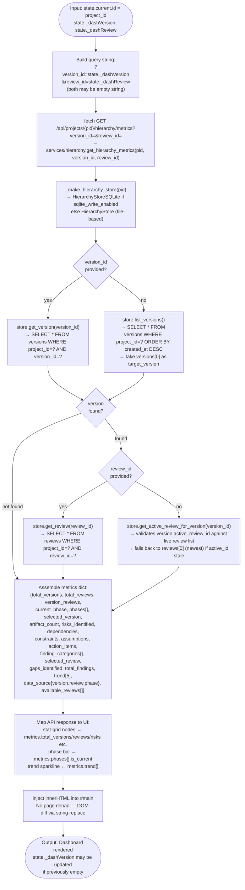
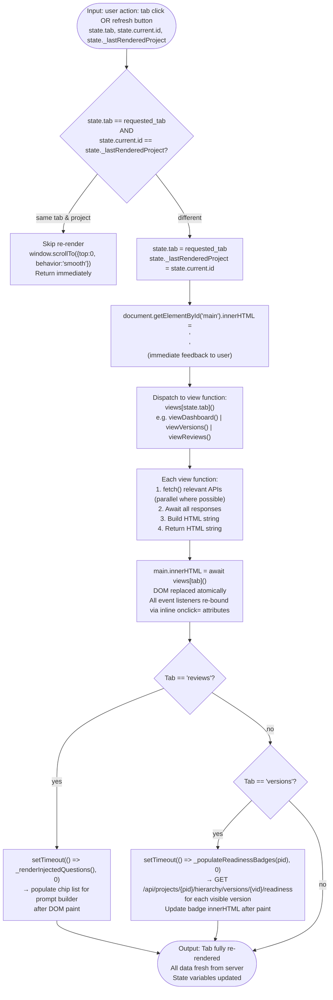

# Logic Flow (Detailed)

## Purpose
Step-by-step internal processing logic for the four core operations:
1. Load Dashboard
2. Select / Build Intelligence Version
3. Run a Review (Load Reviews)
4. Refresh Data

Each flow traces input → processing steps → conditions → output with no vague labels.

---

## Flow 1 — Load Dashboard (`viewDashboard`)



---

## Flow 2 — Build Intelligence Version (`Build Intelligence` button on Ingest tab)

```mermaid
flowchart TD
    BIV_IN([Input: project_id\nai_backend\npersona\nscope text\nselected artifact toggles])

    BIV1["User clicks 'Build Intelligence'\nfetch POST /api/projects/{pid}/build-context\nbody: {ai_backend, persona, scope, file_toggles}"]
    BIV2["handlers/intelligence.handle_build_context(pid, body, R)\n→ validates: project exists, at least one artifact included"]
    BIV3["services/intelligence.build_project_intelligence(pid, backend)\n→ get_project_context(pid): load processed docs from projects_data/{pid}/processed/\n→ include only artifacts where file_toggles[filename]=True"]
    BIV4["processors/context_builder.build_context(documents[])\n→ for each ProcessedDocument: extract scope, risks, assumptions,\n   dependencies, constraints from content field\n→ aggregate into ProjectContext dataclass"]
    BIV5["services/ingest.get_project_context(pid)\n→ load legacy file docs from projects_data/{pid}/context/\n→ merge with artifact documents (deduplicated by filename)"]
    BIV6["Compute stats:\nstats = {risks: len(risks), dependencies: len(deps),\n         constraints: len(constraints), assumptions: len(assumptions)}"]
    BIV7["_make_hierarchy_store(pid).create_version(\n  included_artifacts=[{artifactId, title, category}...],\n  excluded_artifacts=[...],\n  persona=body.persona,\n  scope=body.scope[:2000],\n  ai_backend=backend,\n  label='Version N',\n  stats=stats\n)"]
    BIV8["INSERT INTO versions (version_id=vN, project_id, phase_id,\nlabel, persona, scope, ai_backend, included_artifacts,\nexcluded_artifacts, stats, review_ids=[], created_at)"]
    BIV9["File dual-write:\nprojects_data/{pid}/hierarchy/versions/vN.json\nprojects_data/{pid}/hierarchy/versions/index.json"]
    BIV10["UPDATE phases SET version_count=version_count+1\nWHERE project_id=? AND phase_id=current_phase"]
    BIV11["bus.publish(Event(topic=intelligence.built, payload={project_id, version_id}))"]
    BIV12["Return {version_id, label, artifact_count, stats}\nHTTP 201"]
    BIV13["UI: toast('Intelligence built ✓')\nstate._dashVersion = new version_id\nRe-render versions tab"]
    BIV_OUT([Output: Version vN persisted in SQLite + JSON\nDashboard metrics now reflect new version\nReady to run review against vN])

    BIV_IN --> BIV1 --> BIV2 --> BIV3 --> BIV4 --> BIV5 --> BIV6 --> BIV7 --> BIV8 --> BIV9 --> BIV10 --> BIV11 --> BIV12 --> BIV13 --> BIV_OUT
```



---

## Flow 3 — Run Review (`POST /api/review`)

```mermaid
flowchart TD
    RR_IN([Input: project_id\nroles[] e.g. ['Solution Architect']\nai_backend: files_only|ollama|bedrock|gemini\ncustom_prompt optional\nprevious_review_id optional\nprompt_builder_state{injected_questions[], user_notes}])

    RR1["handlers/review.handle_review(body, R)\n→ validate: project_id present\n→ validate: roles present\n→ build ReviewRequest dataclass\n→ ServiceReviewAgent.run(request)"]
    RR2["bus.publish(Event(topic=review.started,\npayload={project_id, roles[], ai_backend}))"]
    RR3["services/review.run_persona_review(...)"]
    RR4["get_project(project_id)\n→ load from projects.json\n→ raise ValueError if not found"]
    RR5["get_project_intelligence(project_id)\n→ load from projects_data/{pid}/intelligence/current.json\n→ raise ValueError if missing ('Run Build Intelligence first')"]
    RR6["_make_hierarchy_store(pid).list_versions()\n→ raise ValueError if empty ('No versions found')"]
    RR7["admin.guardrails.validate_review_prerequisites(\npid, has_intelligence, ai_backend)\n→ soft guard — ImportError ignored"]
    RR8["personas/engine.run_review(\nroles=roles, context=intelligence,\nai_backend=ai_backend, custom_prompt=custom_prompt\n)"]
    RR9{"ai_backend\n== files_only?"}
    RR10["ai_backends.files_only:\nDeterministic pattern match against context dict\nNo network call\nReturn {findings{risks,gaps,recommendations,questions}, summary}"]
    RR11["ai_backends.get_backend(ai_backend)\n→ ollama: POST http://localhost:11434/api/generate\n→ bedrock: boto3 invoke_model\n→ gemini: REST API with GOOGLE_API_KEY\nReturn parsed LLM response as findings dict"]
    RR12{"ai_backend != files_only\nAND deep-dive enabled?"}
    RR13["personas/deep_dive.run_deep_dive(\npersona_name, scope, intelligence,\nactive_files[], custom_prompt, ai_backend\n)\n→ targeted SME questions → LLM → structured output\nreview['deep_dive'] = deep_dive_result"]
    RR14["Compute derived intelligence:\nextract_weaknesses(findings)\n→ scan findings categories for weak signals → List[{id,text,category,severity,status}]\n\ncompute_missing_categories(findings)\n→ check which artifact categories have no coverage\n\nextract_decision_points(findings)\n→ identify open decisions needing resolution → List[{id,text,category,status}]"]
    RR15{"previous_review_id\nprovided?"}
    RR16["store.get_review(previous_review_id)\n→ inherit open decision_points (status==open)\n→ append to computed_decision_points (deduplicated by text)"]
    RR17["store.create_review(\nversion_id=latest_version_id,\npersona=canonical_persona,\nfindings=review.findings,\nweaknesses=computed_weaknesses,\ndecision_points=computed_decision_points,\nprompt_builder_state=prompt_builder_state,\n…\n)\n→ INSERT INTO reviews (review_id=rN, …)\n→ UPDATE versions SET review_ids=[…], active_review_id=rN\n→ UPDATE phases SET review_count=review_count+1"]
    RR18["processors/prompt_logger.log_prompt(\npid, review_id, prompt_builder_state,\nfinal_prompt, persona_name\n)\n→ INSERT INTO prompt_log"]
    RR19["processors/version_control.create_run_record(\nproject_dir, project_id, run_type='persona_review',\ninput_files[], persona_used, ai_backend, file_toggles\n)"]
    RR20["services/project.update_iteration_on_review(pid)\n→ UPDATE projects SET iteration.total_reviews += 1\n→ iteration.last_review_at = now"]
    RR21["bus.publish(Event(topic=review.completed,\npayload={project_id, review_id, persona,\nweakness_count, decision_point_count,\nmissing_category_count}))"]
    RR22["Return HTTP 200 {review_id, persona, findings{},\nweaknesses[], decision_points[],\nmissing_categories[], summary, questions[]}"]
    RR23["UI: toast('Review complete ✓')\nstate._dashReview = new review_id\nRe-render review list (new rN at top)"]
    RR_OUT([Output: Review rN stored in SQLite\nLinked to version vN\nDashboard metrics updated\nUI list updated without reload])

    RR_IN --> RR1 --> RR2 --> RR3 --> RR4 --> RR5 --> RR6 --> RR7 --> RR8
    RR8 --> RR9
    RR9 -- "yes" --> RR10 --> RR12
    RR9 -- "no" --> RR11 --> RR12
    RR12 -- "yes" --> RR13 --> RR14
    RR12 -- "no" --> RR14
    RR14 --> RR15
    RR15 -- "yes" --> RR16 --> RR17
    RR15 -- "no" --> RR17
    RR17 --> RR18 --> RR19 --> RR20 --> RR21 --> RR22 --> RR23 --> RR_OUT
```

---

## Flow 4 — Refresh Data



---

## Inputs and Outputs Summary

| Flow | Primary Input | Primary Output |
|---|---|---|
| Load Dashboard | `project_id`, `version_id?`, `review_id?` | Metrics dict mapped to stat-grid + phase bar HTML |
| Build Intelligence Version | `project_id` + artifact toggles | Version vN in SQLite; `state._dashVersion` updated |
| Run Review | `project_id`, `roles[]`, `ai_backend` | Review rN in SQLite; UI list updated |
| Refresh Data | `state.tab`, user interaction | Re-fetched and re-injected tab HTML |

---

## Error Cases per Flow

| Flow | Error Condition | Handling |
|---|---|---|
| Load Dashboard | Project has no versions | `metrics.total_versions=0`; dashboard renders zero counts |
| Load Dashboard | API fetch fails | `catch(e)` → render error card in `#main` |
| Build Intelligence | No artifacts included | `services/intelligence` raises `ValueError` → HTTP 400 |
| Build Intelligence | No active artifacts processed | `ValueError("No intelligence built")` → HTTP 400 |
| Run Review | Intelligence not built | `ValueError("No intelligence built … run Build Intelligence first")` → HTTP 400 |
| Run Review | No versions exist | `ValueError("No intelligence version found")` → HTTP 400 |
| Run Review | AI backend unreachable | `Exception` caught → `bus.publish(review.failed)` → HTTP 500 |
| Refresh | Same tab/project guard | No-op (scroll only) |

---

## Linked Components

| Component | File |
|---|---|
| `viewDashboard()` | `static/index.html` |
| `viewVersions()` | `static/index.html` |
| `viewReviews()` | `static/index.html` |
| `get_hierarchy_metrics()` | `services/hierarchy.py` |
| `run_persona_review()` | `services/review.py` |
| `build_project_intelligence()` | `services/intelligence.py` |
| `run_review()` (AI dispatch) | `personas/engine.py` |
| `extract_weaknesses()` | `processors/review_quality.py` |
| `extract_decision_points()` | `processors/review_quality.py` |
| `create_review()` | `models/hierarchy.py` / `db/hierarchy_store_sql.py` |
| `log_prompt()` | `processors/prompt_logger.py` |
