# Sequence Flows

**Project Delivery Accelerator Engine — V2 Interaction Sequence Diagrams**

> Each diagram shows the full message sequence between actors for a specific user interaction. Participants map directly to files in this repository.

---

## Linked Components

| Participant | File |
|-------------|------|
| User | — (browser) |
| Browser | `static/v2/dashboard_v2.html` |
| Dashboard | `static/v2/js/dashboard.js` |
| AppState | `static/v2/js/state.js` |
| API | `static/v2/js/api.js` |
| Accordion | `static/v2/js/accordion.js` |
| DetailPanel | `ui/v2/components/DetailPanel.js` |
| Server | `server.py` |
| HierarchyService | `services/hierarchy.py` |
| HierarchyStore | `models/hierarchy.py` |

---

## Sequence 1: Page Load and Initial Render

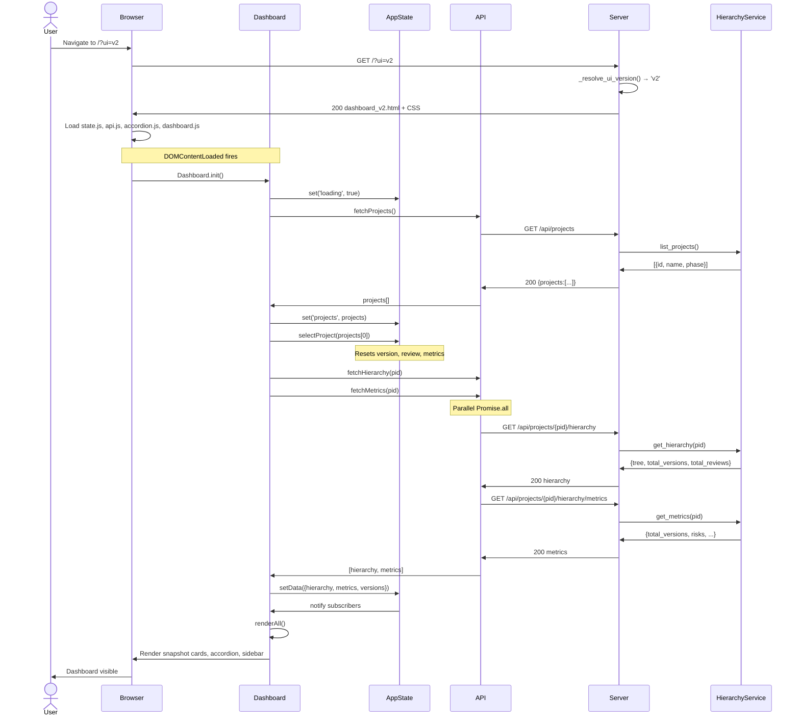

---

## Sequence 2: Version Selection (Header Dropdown)

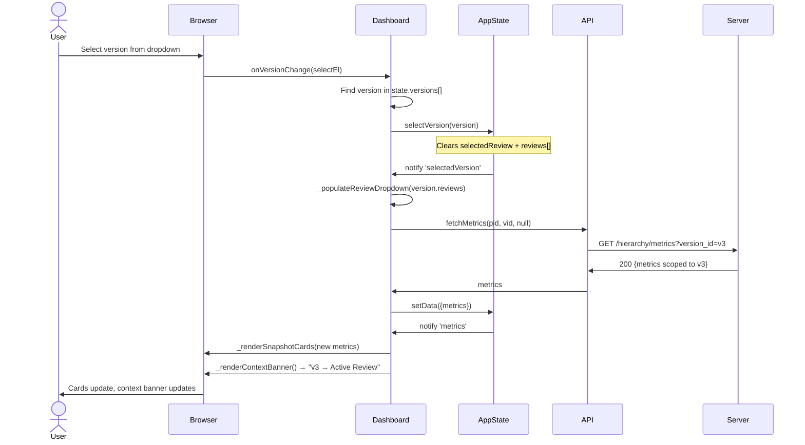

---

## Sequence 3: Review Click → Detail Drawer Opens

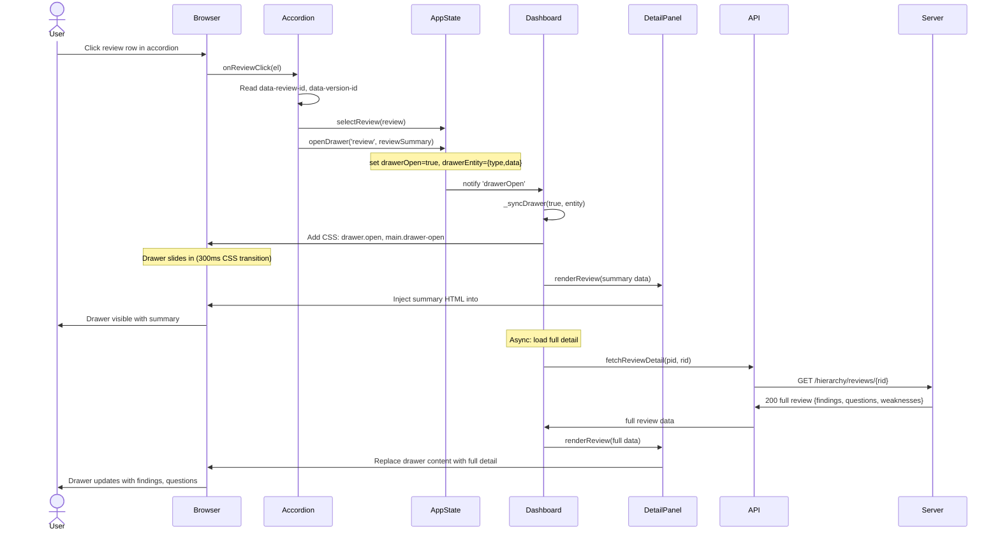

---

## Sequence 4: Refresh Loop (No Page Reload)

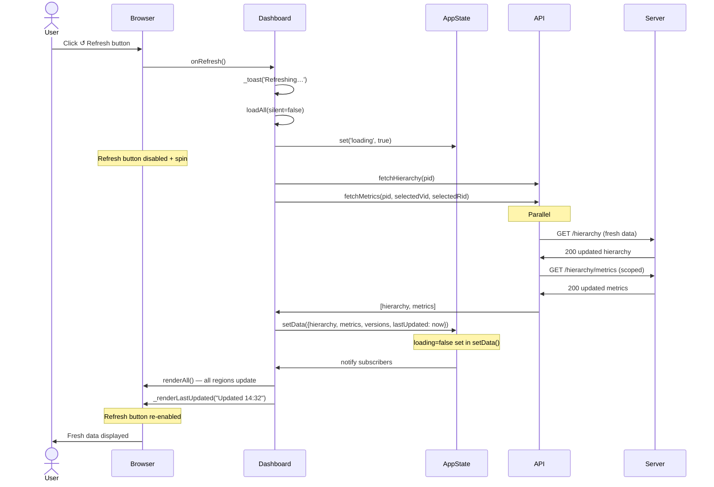

---

## Sequence 5: Drawer Close (Esc Key or × Button)

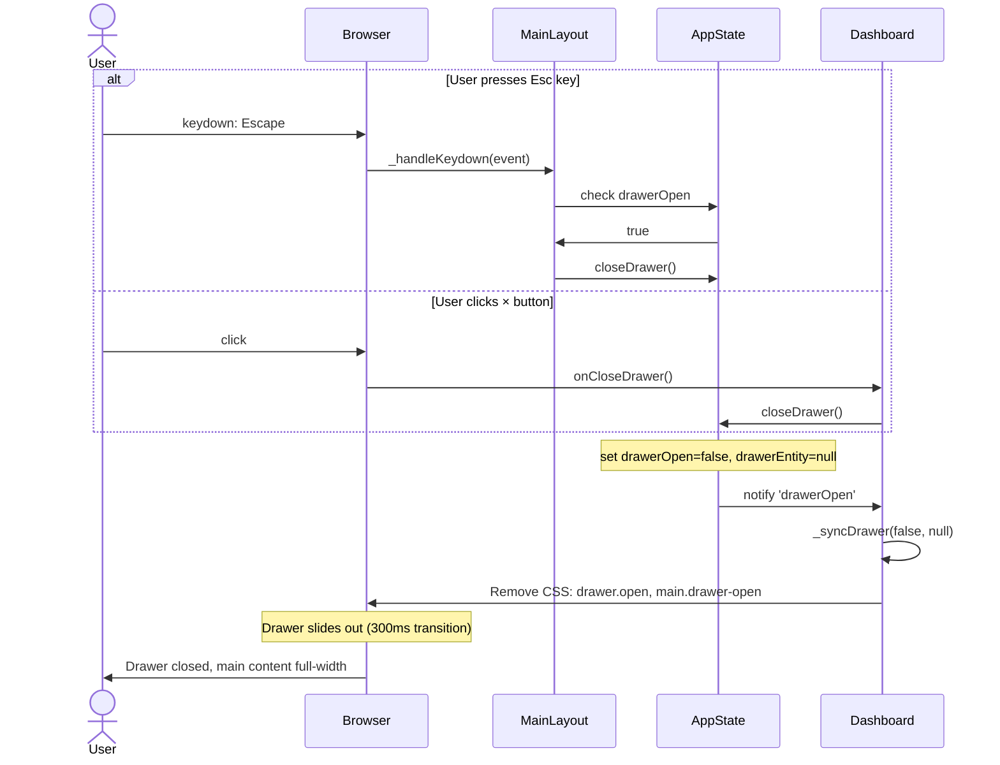

---

## Sequence 6: Accordion Expand / Collapse All

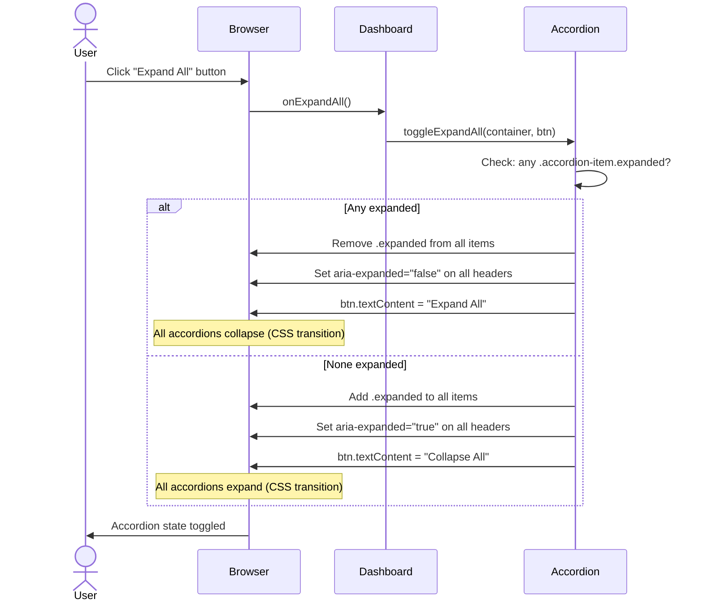

---

## Sequence 7: Weakness User Note Update (S9-03)

```mermaid
sequenceDiagram
    actor User
    participant Browser
    participant Server
    participant ReviewHandler
    participant ReviewService
    participant HierarchyStore

    Note over Browser: Review detail view is open.<br/>User edits the note textarea under a weakness item.

    User->>Browser: Tab / click away from textarea (blur event)
    Browser->>Browser: onblur fires → updateWeaknessStatus(reviewId, weaknessId, null, this.value)
    Note over Browser: status=null (no change), note=textarea.value
    Browser->>Browser: Read current status from sibling <select>
    Browser->>Server: POST /api/projects/{pid}/hierarchy/reviews/{rid}/weakness/{wid}/status<br/>body: { status: "open", user_note: "Confirmed by client" }

    Server->>ReviewHandler: handle_weakness_status(pid, rid, wid, body)
    ReviewHandler->>ReviewHandler: status = body["status"]<br/>user_note = body["user_note"]
    ReviewHandler->>ReviewService: update_weakness_status(pid, rid, wid, status, user_note=note)

    ReviewService->>HierarchyStore: get_review(rid)
    HierarchyStore->>ReviewService: Review dataclass

    ReviewService->>ReviewService: Find weakness by id<br/>target["status"] = status<br/>target["user_note"] = user_note

    ReviewService->>HierarchyStore: update_review_weaknesses(rid, weaknesses)
    HierarchyStore->>HierarchyStore: UPDATE reviews SET weaknesses=? WHERE review_id=?<br/>+ file dual-write

    ReviewService->>ReviewHandler: { review_id, weakness_id, status, user_note, updated: true }
    ReviewHandler->>Server: respond(result, 200)
    Server->>Browser: 200 { updated: true, user_note: "Confirmed by client" }

    Note over Browser: No re-render needed — textarea already shows the value.
    Browser->>User: (silent success)

    alt Status-only update (user changes <select>)
        User->>Browser: Change status dropdown
        Browser->>Server: POST … body: { status: "addressed", user_note: null }
        Note over Server: user_note=None → service skips target["user_note"] assignment<br/>Existing note is preserved.
    end
```

### Key rules enforced (S9-03)
| Rule | Where |
|------|-------|
| `user_note` defaults to `""` on every new weakness | `processors/review_quality.py → extract_weaknesses()` |
| Status-only call (no `user_note` key) leaves note unchanged | `services/review.py → update_weakness_status()` |
| Note-only blur sends current status from sibling `<select>` | `static/index.html → updateWeaknessStatus()` |
| Existing reviews without `user_note` render empty textarea (no error) | `static/index.html` — `w.user_note\|\|''` |

---

## Sequence 8: Review Compare via Hierarchy Store (Compare bug fix)

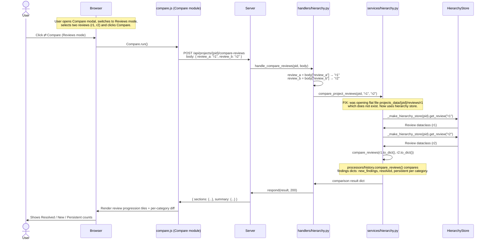

### Root cause of the bug
`compare_project_reviews()` was looking for a file at:
`projects_data/{pid}/reviews/<review_id>` — the legacy flat-file store path.
The hierarchy store (SQLite-backed) stores reviews in `projects_data/{pid}/hierarchy/reviews/`
and uses IDs like `r1`, not filenames. The flat-file path never exists for hierarchy reviews,
so the function always raised `ValueError("Review not found: r1")`.

### Fix
`services/hierarchy.py → compare_project_reviews()` now calls
`_make_hierarchy_store(pid).get_review(review_id)` for both reviews,
then passes `review.to_dict()` to `processors/history.compare_reviews()`.

---

## Sequence 9: v2 Reviews Tab — Full Action Set

The v2 Reviews tab (`static/v2/dashboard_v2.html`) previously rendered
each review with only a Compare button. All the following actions are now
available in both the Reviews tab and the Versions tab review-item-body:

| Action | Function | API call |
|--------|----------|----------|
| Full Details | `v2ViewReviewDetail(rid)` | Sets `state._v2ReviewDetail`, re-renders |
| Set Active | `v2SetActiveReview(vid, rid)` | `POST /hierarchy/versions/{vid}/active-review` |
| Mark as Draft | `v2OpenMarkComplete(rid,'interim')` | `POST /hierarchy/reviews/{rid}/complete` |
| Mark as Final | `v2OpenMarkComplete(rid,'complete')` | `POST /hierarchy/reviews/{rid}/complete` |
| Delete | `v2DeleteReview(rid)` | `POST /hierarchy/reviews/{rid}/delete` |
| Run Review | `v2RunReview()` | `POST /api/review` |
| Ask SME | `v2RunDeepDive()` | `POST /api/projects/{pid}/deep-dive` |
| Add to Prompt | `v2AddSelectedToPrompt()` | Client-side state update only |

All functions use the `v2` prefix to avoid collision with the v1 global namespace.
Role checkboxes use class `v2-role-check` (vs v1's `role-check`).

---

## Sequence 10: Phase 1 — V2 Connects to Live Backend

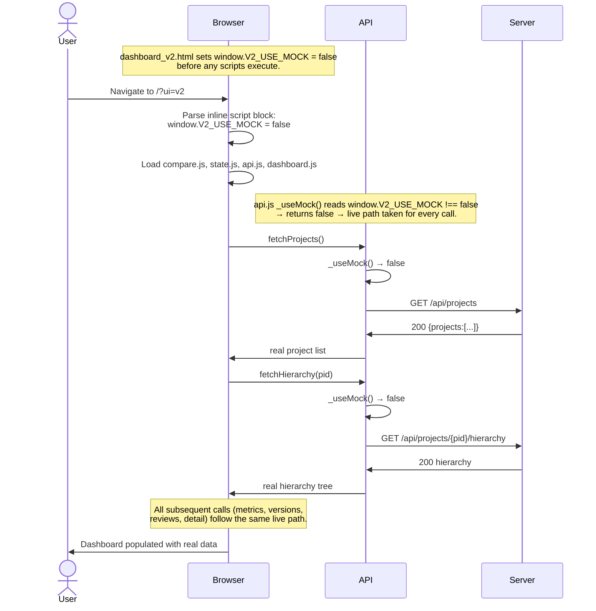

### What changed (Phase 1)
| File | Change |
|------|--------|
| `static/v2/dashboard_v2.html` | Added `` before `compare.js` |

### Contract preserved
- Mock data in `api.js` is retained for local offline development.
- To re-enable mock mode, set `window.V2_USE_MOCK = true` in the HTML.
- `_useMock()` guard still wraps every mock return path — no unconditional mock returns.

---

## Sequence 11: Phase 2 — V2 Weakness Status Update from Drawer

```mermaid
sequenceDiagram
    actor User
    participant Browser
    participant DetailPanel
    participant API
    participant Server
    participant ReviewHandler
    participant ReviewService
    participant HierarchyStore

    Note over Browser: Review detail drawer is open.<br/>renderReview() has rendered weakness rows<br/>with status <select> and note <textarea>.

    alt User changes status dropdown
        User->>Browser: Change status <select> → "addressed"
        Browser->>DetailPanel: _onWeaknessStatusChange(selectEl)
        DetailPanel->>DetailPanel: Read data-pid, data-rid, data-wid from selectEl.dataset
        DetailPanel->>API: updateWeaknessStatus(pid, rid, wid, "addressed", null)
        Note over API: userNote=null → body only contains {status}.<br/>Existing note is preserved server-side.
        API->>Server: POST /api/projects/{pid}/hierarchy/reviews/{rid}/weakness/{wid}/status<br/>body: { status: "addressed" }
        Server->>ReviewHandler: handle_weakness_status(pid, rid, wid, body)
        ReviewHandler->>ReviewService: update_weakness_status(pid, rid, wid, "addressed", user_note=None)
        ReviewService->>HierarchyStore: get_review(rid)
        HierarchyStore->>ReviewService: Review dataclass
        ReviewService->>ReviewService: target["status"] = "addressed"<br/>(user_note untouched — None passed)
        ReviewService->>HierarchyStore: update_review_weaknesses(rid, weaknesses)
        HierarchyStore->>ReviewService: persisted
        ReviewService->>ReviewHandler: { updated: true, status: "addressed" }
        ReviewHandler->>Server: respond(result, 200)
        Server->>API: 200 { updated: true }
        API->>DetailPanel: result
        Note over Browser: No re-render — select already shows new value.
        Browser->>User: (silent success)
    end

    alt User types a note and tabs away
        User->>Browser: Type note text → blur textarea
        Browser->>DetailPanel: _onWeaknessNoteBlur(textarea)
        DetailPanel->>DetailPanel: Read data-pid, data-rid, data-wid from textarea.dataset
        DetailPanel->>DetailPanel: Find sibling <select> in .weakness-row → read .value
        DetailPanel->>API: updateWeaknessStatus(pid, rid, wid, currentStatus, textarea.value)
        Note over API: Both status and user_note are sent.
        API->>Server: POST … body: { status: "addressed", user_note: "Confirmed by client" }
        Server->>ReviewHandler: handle_weakness_status(pid, rid, wid, body)
        ReviewHandler->>ReviewService: update_weakness_status(…, "addressed", user_note="Confirmed by client")
        ReviewService->>ReviewService: target["status"] = "addressed"<br/>target["user_note"] = "Confirmed by client"
        ReviewService->>HierarchyStore: update_review_weaknesses(rid, weaknesses)
        HierarchyStore->>ReviewService: persisted
        ReviewService->>ReviewHandler: { updated: true, user_note: "Confirmed by client" }
        ReviewHandler->>Server: respond(result, 200)
        Server->>API: 200 { updated: true, user_note: "Confirmed by client" }
        Note over Browser: No re-render — textarea already shows the value.
        Browser->>User: (silent success)
    end
```

---

## Sequence 12: Phase 2 — V2 Decision Point Status Update from Drawer

```mermaid
sequenceDiagram
    actor User
    participant Browser
    participant DetailPanel
    participant API
    participant Server
    participant ReviewHandler
    participant ReviewService
    participant HierarchyStore

    Note over Browser: Review detail drawer is open.<br/>renderReview() has rendered decision point rows<br/>each with a status <select>.

    User->>Browser: Change decision status <select> → "validated"
    Browser->>DetailPanel: _onDecisionStatusChange(selectEl)
    DetailPanel->>DetailPanel: Read data-pid, data-rid, data-did from selectEl.dataset
    DetailPanel->>API: updateDecisionStatus(pid, rid, did, "validated")
    API->>Server: POST /api/projects/{pid}/hierarchy/reviews/{rid}/decision/{did}/status<br/>body: { status: "validated" }

    Server->>ReviewHandler: handle_decision_status(pid, rid, did, body)
    ReviewHandler->>ReviewService: update_decision_status(pid, rid, did, "validated")
    ReviewService->>HierarchyStore: get_review(rid)
    HierarchyStore->>ReviewService: Review dataclass
    ReviewService->>ReviewService: Find dp by id<br/>target["status"] = "validated"
    ReviewService->>HierarchyStore: update_review_decision_points(rid, dps)
    HierarchyStore->>ReviewService: persisted
    ReviewService->>ReviewHandler: { updated: true, decision_id: did, status: "validated" }
    ReviewHandler->>Server: respond(result, 200)
    Server->>API: 200 { updated: true }
    API->>DetailPanel: result

    Note over Browser: No re-render — select already shows new value.
    Browser->>User: (silent success)
```

---

## Sequence 13: Phase 2 — V2 Provenance Line Render

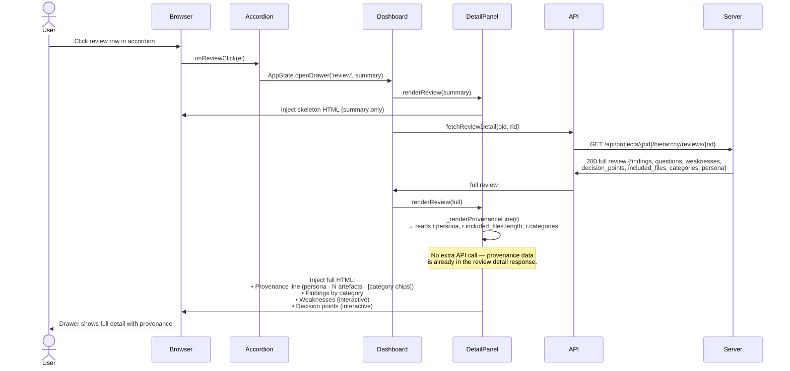

### Provenance line data sources (Phase 2.3)
| Field shown | Source in Review object |
|-------------|------------------------|
| Persona label | `review.persona` |
| Artefact count | `review.included_files.length` |
| Category chips | `review.categories[]` (up to 4, +N overflow) |

### Key rules enforced (Phase 2)
| Rule | Where enforced |
|------|----------------|
| `userNote=null` → `user_note` key absent from POST body | `api.js → updateWeaknessStatus()` |
| `user_note=None` on service → existing note preserved | `services/review.py → update_weakness_status()` |
| Status-only change does not re-render the drawer | `DetailPanel.js → _onWeaknessStatusChange()` |
| Note blur reads current status from sibling `<select>` | `DetailPanel.js → _onWeaknessNoteBlur()` |
| All weaknesses rendered (not just open) so any can be updated | `DetailPanel.js → renderReview()` |
| Provenance line rendered above findings, no extra API call | `DetailPanel.js → _renderProvenanceLine()` |
| `projectId` resolved from `AppState.get('selectedProject')` at render time | `DetailPanel.js → renderReview()` |

### Linked components — Phase 2 additions
| Participant | File |
|-------------|------|
| DetailPanel | `ui/v2/components/DetailPanel.js` |
| API | `static/v2/js/api.js` |
| ReviewHandler | `handlers/review.py` |
| ReviewService | `services/review.py` |
| HierarchyStore | `models/hierarchy.py` |
