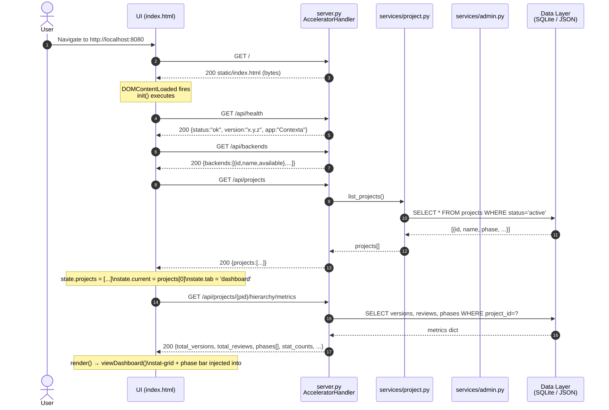
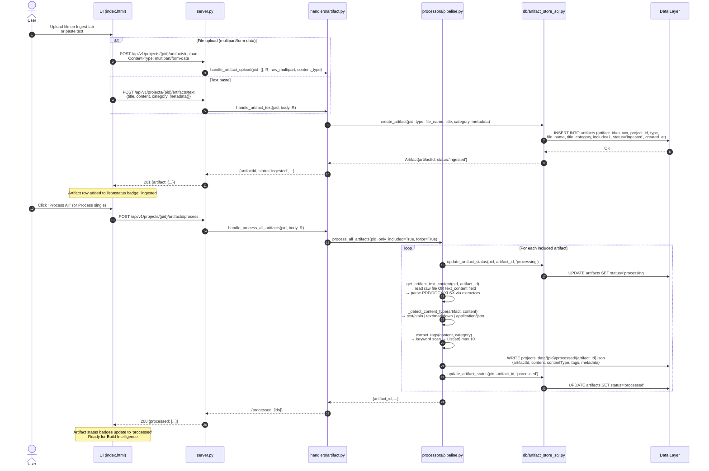
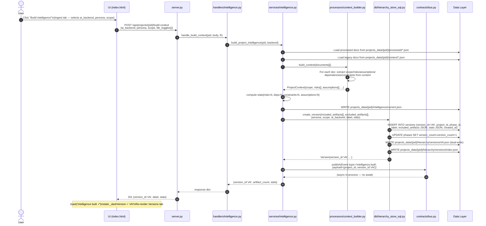
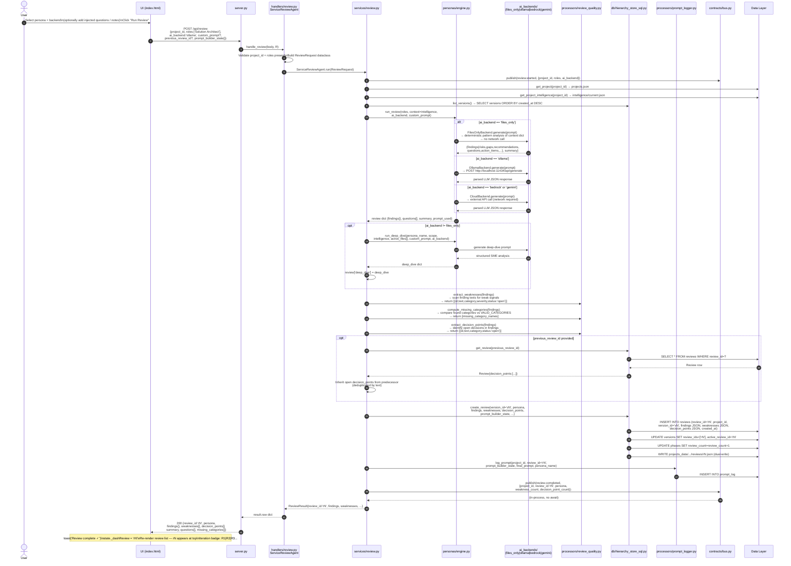
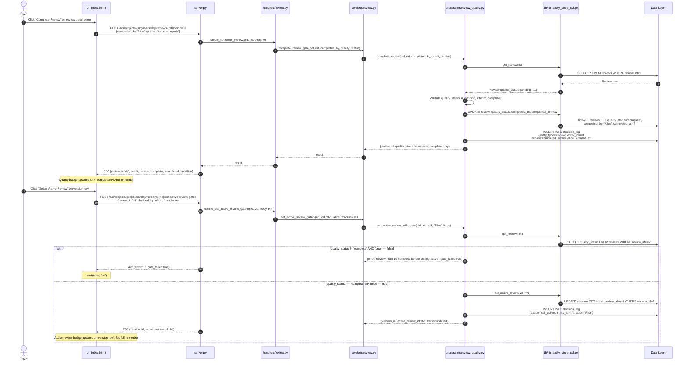

# Sequence Flows

## Purpose
Actor-level message choreography for the five most critical system operations.
Shows request/response pairs, async patterns, event bus publications, and
state changes returned to the UI.

---

## Sequence 1 — Application Boot

---

## Sequence 2 — Artifact Ingest & Processing

---

## Sequence 3 — Build Intelligence & Create Version

---

## Sequence 4 — Run Persona Review

---

## Sequence 5 — Review Quality Gate & Set Active Review

---

## Inputs and Outputs

| Sequence | Input Actors | Key Inputs | Key Outputs |
|---|---|---|---|
| Boot | User + Browser | URL `http://localhost:8080` | Populated SPA with project dashboard |
| Artifact Ingest | User + Browser | File bytes or text + category | `artifact_id` stored; status `'ingested'` → `'processed'` |
| Build Version | User + Browser | `project_id`, artifact selection, persona | Version `vN` in DB; `intelligence/current.json` written |
| Run Review | User + Browser | `roles[]`, `ai_backend` | Review `rN` in DB; findings/weaknesses/decisions returned |
| Quality Gate | User + Browser | `review_id`, `completed_by` | `quality_status` = `complete`; decision log entry |

---

## Async / Fire-and-Forget Patterns

| Call | Pattern | Notes |
|---|---|---|
| `bus.publish(review.started)` | In-process sync publish; subscribers receive synchronously | No network I/O; no await needed |
| `bus.publish(review.completed)` | Same | Decouples post-review hooks from the critical path |
| `setTimeout(_renderInjectedQuestions, 0)` | Browser microtask after paint | DOM must exist before chip rendering |
| `setTimeout(_populateReadinessBadges, 0)` | Browser microtask after paint | Per-version readiness fetch after list paint |

---

## Linked Components

| Component | File |
|---|---|
| `handle_review()` | `handlers/review.py` |
| `run_persona_review()` | `services/review.py` |
| `run_review()` | `personas/engine.py` |
| `extract_weaknesses()` / `extract_decision_points()` | `processors/review_quality.py` |
| `create_review()` | `db/hierarchy_store_sql.py` |
| `log_prompt()` | `processors/prompt_logger.py` |
| `ServiceBus.publish()` | `contracts/bus.py` |
| `complete_review()` / `set_active_review_with_gate()` | `processors/review_quality.py` |
