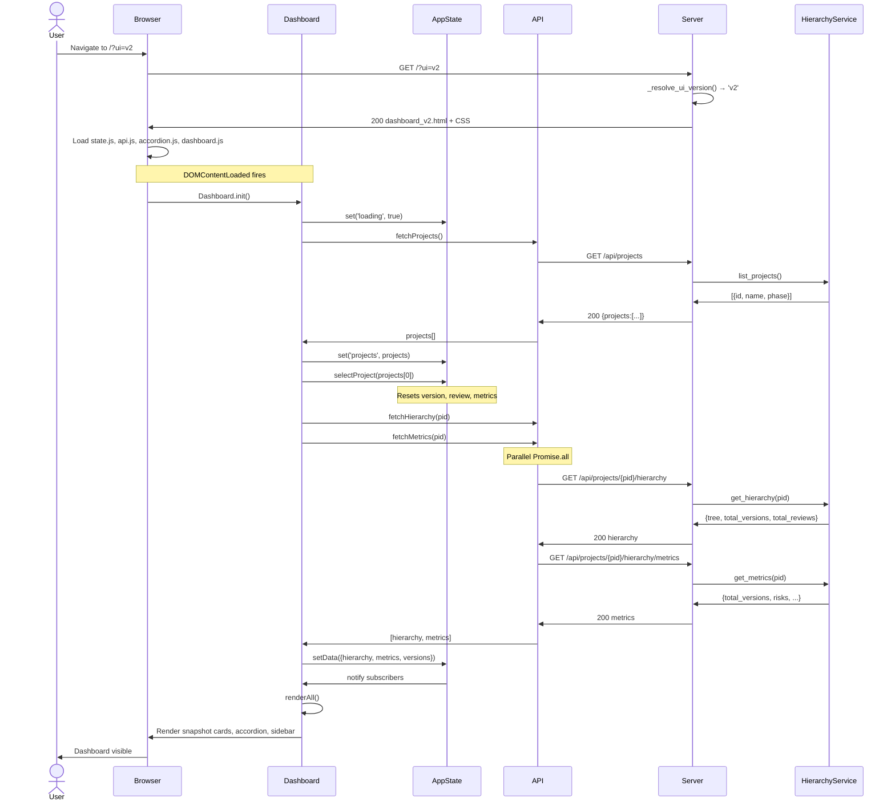
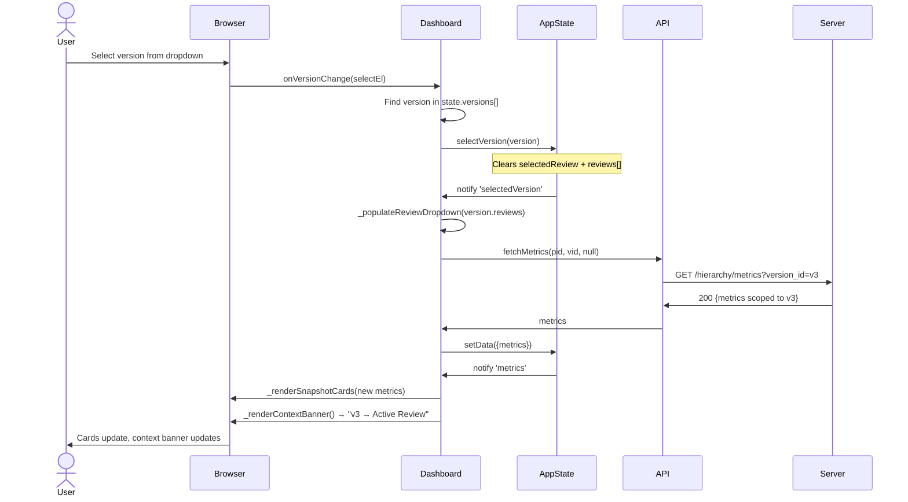
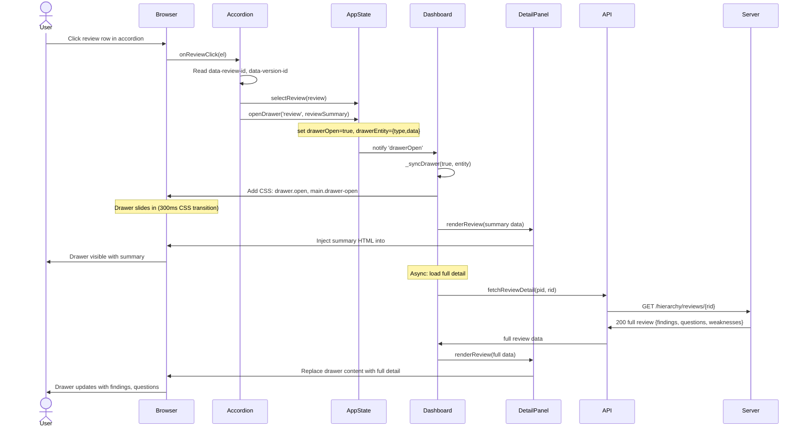
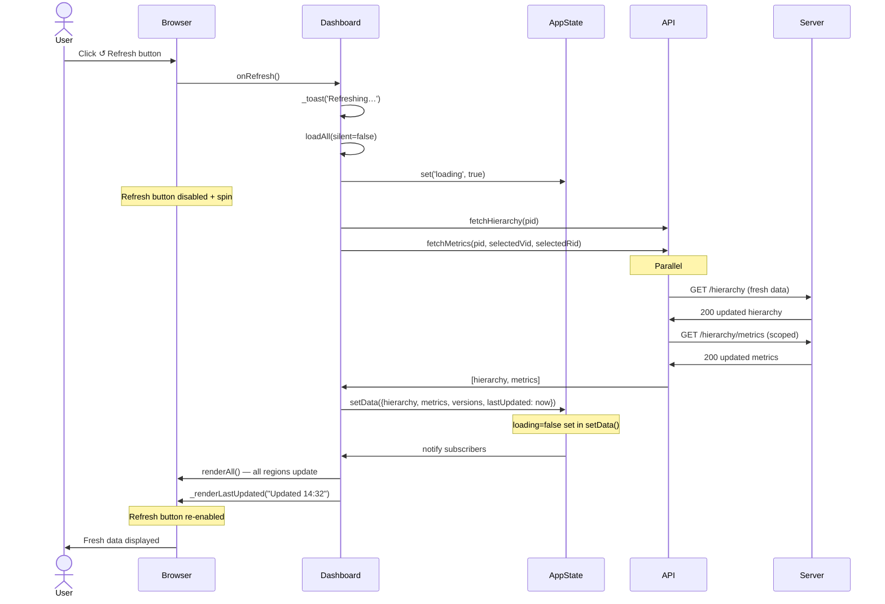
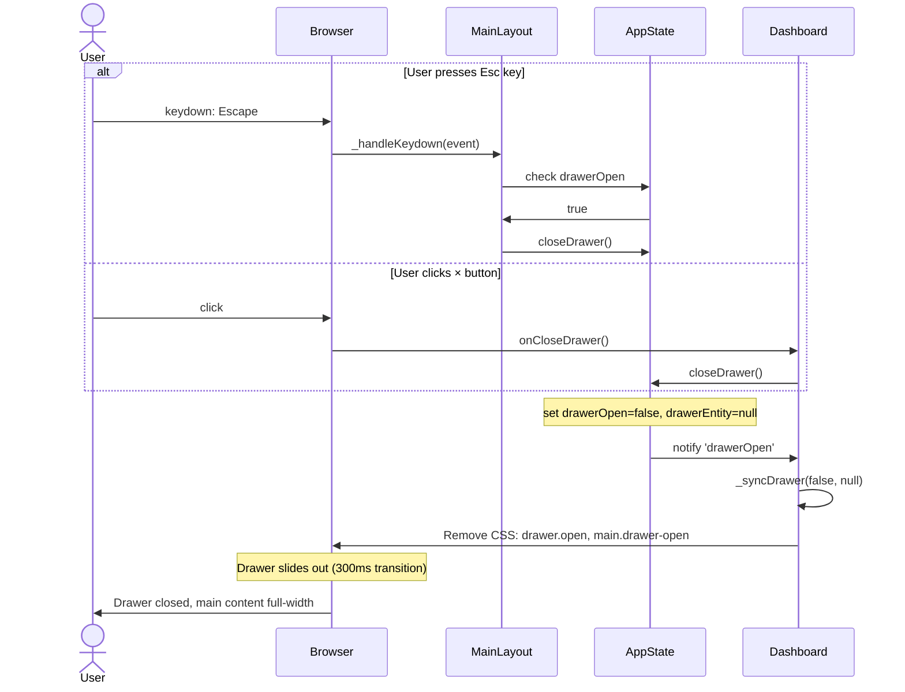
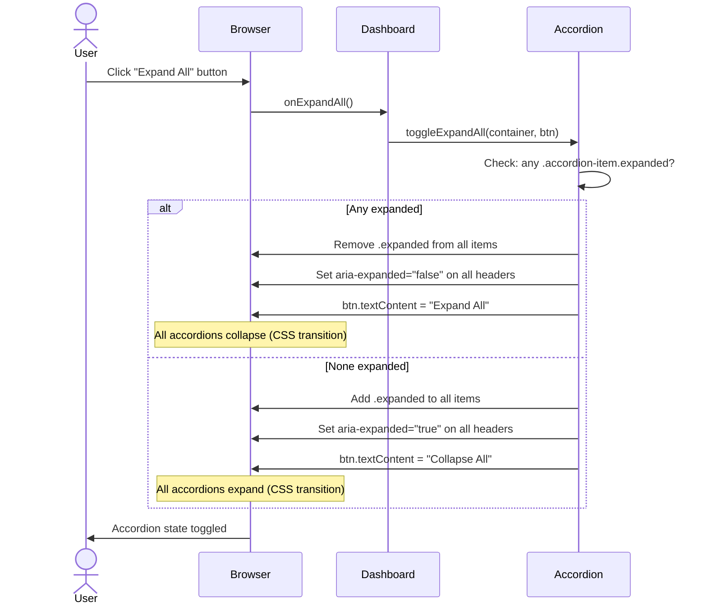

# Sequence Flows

**Project Delivery Accelerator Engine — V2 Interaction Sequence Diagrams**

> Each diagram shows the full message sequence between actors for a specific user interaction. Participants map directly to files in this repository.

---

## Linked Components

| Participant | File |
|-------------|------|
| User | — (browser) |
| Browser | `static/v2/dashboard_v2.html` |
| Dashboard | `static/v2/js/dashboard.js` |
| AppState | `static/v2/js/state.js` |
| API | `static/v2/js/api.js` |
| Accordion | `static/v2/js/accordion.js` |
| DetailPanel | `ui/v2/components/DetailPanel.js` |
| Server | `server.py` |
| HierarchyService | `services/hierarchy.py` |
| HierarchyStore | `models/hierarchy.py` |

---

## Sequence 1: Page Load and Initial Render

---

## Sequence 2: Version Selection (Header Dropdown)

---

## Sequence 3: Review Click → Detail Drawer Opens

---

## Sequence 4: Refresh Loop (No Page Reload)

---

## Sequence 5: Drawer Close (Esc Key or × Button)

---

## Sequence 6: Accordion Expand / Collapse All

