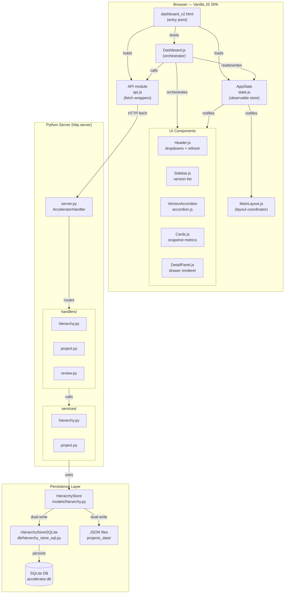
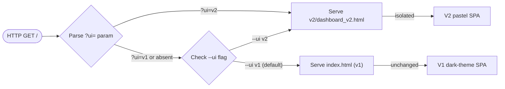

# System Overview

**Project Delivery Accelerator Engine — V2 Architecture**

> This document describes the full system architecture: runtime layers, component boundaries, and data flow direction. Every node links to a real file in this repository.

---

## Linked Components

| Layer | File |
|-------|------|
| Entry point (v2) | `static/v2/dashboard_v2.html` |
| Server | `server.py` |
| State store | `static/v2/js/state.js` |
| API module | `static/v2/js/api.js` |
| Accordion | `static/v2/js/accordion.js` |
| Orchestrator | `static/v2/js/dashboard.js` |
| Detail drawer | `ui/v2/components/DetailPanel.js` |
| Cards | `ui/v2/components/Cards.js` |
| Header | `ui/v2/components/Header.js` |
| Sidebar | `ui/v2/components/Sidebar.js` |
| Layout coordinator | `ui/v2/layout/MainLayout.js` |
| Hierarchy service | `services/hierarchy.py` |
| Hierarchy store | `models/hierarchy.py` |
| Data persistence | `db/hierarchy_store_sql.py` |

---

## System Architecture Diagram

---

## Layer Descriptions

### Browser Layer
- **dashboard_v2.html** — Static HTML shell. No server-side templating. Served as a flat file by `server.py`.
- **AppState** — Singleton observable store. Holds `projects`, `selectedProject`, `selectedVersion`, `selectedReview`, `metrics`, `hierarchy`, `drawerOpen`. Components subscribe to specific keys; changes notify only relevant subscribers.
- **API module** — All `fetch` calls isolated here. Supports mock data fallback (`window.V2_USE_MOCK = true`) for Step 1 development without a running backend.
- **Dashboard.js** — Orchestrator. Calls `API`, writes to `AppState`, renders all regions. Auto-boots on `DOMContentLoaded`.
- **Components** — Pure renderers. Receive data, return HTML strings or mutate specific DOM nodes. No direct API calls.
- **MainLayout.js** — Handles CSS class mutations for drawer, loading state, keyboard events. No business logic.

### Server Layer
- **server.py** — `http.server.HTTPServer` with `AcceleratorHandler`. Zero business logic. Routes `GET /` to `static/index.html` (v1) or `static/v2/dashboard_v2.html` (v2) based on `--ui` flag or `?ui=` query param.
- **handlers/** — Thin request parsers. Extract path params, call services, return JSON.
- **services/** — All business logic. Hierarchy, projects, reviews, intelligence, proposals.

### Persistence Layer
- **HierarchyStore** — File-based JSON persistence (`projects_data/{pid}/hierarchy/`).
- **HierarchyStoreSQLite** — SQLite-backed alternative. Selected via admin config (`sqlite_write_enabled`).
- Dual-write mode is the default: both stores receive every write.

---

## UI Version Selection Flow

**Key constraint:** v1 and v2 are fully isolated. No shared JS or CSS. v1 (`static/index.html`) is never modified.
