# System Overview

## Purpose
High-level component map of the Project Delivery Accelerator Engine (PDAE).
Shows every major layer, the data paths between them, and the single-container
deployment boundary.

---

## Diagram

```mermaid
graph TD
    %% ── External actors ────────────────────────────────────────
    User["👤 User\n(Browser)"]
    AIExt["☁️ External AI\n(Ollama · Bedrock · Gemini)"]

    subgraph Docker["🐳 Single Docker Container  (port 8080)"]

        %% ── Presentation layer ──────────────────────────────────
        subgraph UI["Presentation Layer"]
            HTML["static/index.html\nSingle-Page App\n(Vanilla JS, no framework)"]
            FeedHTML["static/feedback.html\nExternal feedback form"]
        end

        %% ── Routing layer ───────────────────────────────────────
        subgraph Routing["Routing Layer  (server.py)"]
            HTTP["AcceleratorHandler\nextends SimpleHTTPRequestHandler\ndo_GET · do_POST · do_PATCH"]
        end

        %% ── Handler layer ───────────────────────────────────────
        subgraph Handlers["Handler Layer  (handlers/)"]
            H_Project["handlers/project.py\nCRUD + lifecycle"]
            H_Hierarchy["handlers/hierarchy.py\nPhase · Version · Review tree"]
            H_Review["handlers/review.py\nRun review · quality gate"]
            H_Ingest["handlers/ingest.py\nArtifact ingestion"]
            H_Intel["handlers/intelligence.py\nContext build · personas"]
            H_Presales["handlers/presales.py\nFeedback · tokens · finalise"]
            H_Proposal["handlers/proposal.py\nProposal docs"]
            H_Artifact["handlers/artifact.py\nUpload · process · toggle"]
            H_Diagram["handlers/diagram.py\nDiagram generate"]
            H_Deepdive["handlers/deepdive.py\nSME deep-dive"]
            H_Admin["handlers/admin.py\nConfig · health · lifecycle"]
        end

        %% ── Service layer ───────────────────────────────────────
        subgraph Services["Service Layer  (services/)"]
            S_Project["services/project.py\nProject store · file toggles"]
            S_Hierarchy["services/hierarchy.py\nPhase→Version→Review ops"]
            S_Review["services/review.py\nrun_persona_review · quality"]
            S_Ingest["services/ingest.py\nDocument context assembly"]
            S_Intel["services/intelligence.py\nIntelligence build · summary"]
            S_Presales["services/presales.py\nFeedback lifecycle · tokens"]
            S_Proposal["services/proposal.py\nProposal generation"]
            S_Diagram["services/diagram.py\nDrawio generation"]
            S_Admin["services/admin.py\nConfig · health · lifecycle logs"]
        end

        %% ── Processor layer ─────────────────────────────────────
        subgraph Processors["Processor Layer  (processors/)"]
            P_Pipeline["processors/pipeline.py\nArtifact ingestion pipeline\ningested→processing→processed"]
            P_ContextBuilder["processors/context_builder.py\nAssemble intelligence context"]
            P_ReviewQuality["processors/review_quality.py\nextract_weaknesses · decision_points\ncompute_missing_categories · gates"]
            P_VersionControl["processors/version_control.py\ncreate_run_record · get_run_history"]
            P_PromptLogger["processors/prompt_logger.py\nlog_prompt · query_prompts"]
            P_ReviewSynth["processors/review_synthesizer.py\nMulti-review synthesis"]
        end

        %% ── Persona / AI engine ─────────────────────────────────
        subgraph PersonaEngine["Persona Engine  (personas/)"]
            PE_Engine["personas/engine.py\nrun_review(roles, context,\nai_backend, custom_prompt)"]
            PE_DeepDive["personas/deep_dive.py\nrun_deep_dive(persona, scope,\nintelligence, active_files)"]
        end

        %% ── AI backend registry ─────────────────────────────────
        subgraph AIBackends["AI Backends  (ai_backends/)"]
            AB_FilesOnly["files_only\nDeterministic pattern analysis\n(no API call)"]
            AB_Ollama["ollama\nLocal LLM via Ollama REST"]
            AB_Bedrock["bedrock\nAWS Bedrock Claude"]
            AB_Gemini["gemini\nGoogle Gemini Pro"]
        end

        %% ── Contracts / event bus ───────────────────────────────
        subgraph Contracts["Contracts  (contracts/)"]
            Bus["contracts/bus.py\nServiceBus · publish / subscribe"]
            Types["contracts/types.py\nReviewRequest · ReviewResult · Event · Topics"]
            Proto["contracts/protocols.py\nReviewAgent protocol\nServiceReviewAgent"]
        end

        %% ── Data layer ──────────────────────────────────────────
        subgraph DataLayer["Data Layer"]
            DB_SQLite["SQLite  (accelerator.db)\nprojects · phases · versions\nreviews · artifacts · proposals\ndecision_log · prompt_log"]
            DB_Files["Flat Files  (projects_data/)\nJSON dual-write\nversions/ reviews/ phases.json\nraw/ processed/ artifacts/"]
            DB_Jobs["jobs/  (projects_data/jobs/)\nJob tracking JSON"]
        end

    end

    %% ── Flow ────────────────────────────────────────────────────
    User -- "HTTP GET/POST/PATCH\nfetch() calls" --> HTTP
    HTTP -- "serve static" --> HTML
    HTTP -- "serve static" --> FeedHTML
    HTTP -- "parse path + body\nroute to handler" --> Handlers
    Handlers -- "validate input\ncall service" --> Services
    Services -- "orchestrate logic\ncall processors" --> Processors
    Services -- "run_review()" --> PE_Engine
    Services -- "run_deep_dive()" --> PE_DeepDive
    PE_Engine -- "generate(prompt)" --> AIBackends
    PE_DeepDive -- "generate(prompt)" --> AIBackends
    AB_Ollama -- "REST API" --> AIExt
    AB_Bedrock -- "AWS SDK" --> AIExt
    AB_Gemini -- "REST API" --> AIExt
    Services -- "publish Event" --> Bus
    Handlers -- "publish Event" --> Bus
    Services -- "read/write" --> DataLayer
    Processors -- "read/write" --> DataLayer
    HTML -- "state.js in-memory\nno page reload" --> HTML
```

---

## Inputs and Outputs

| Layer | Input | Output |
|---|---|---|
| User (Browser) | Clicks, form submissions, `fetch()` calls | HTTP requests to `server.py` |
| AcceleratorHandler | Raw HTTP request (path, body, headers) | JSON responses or static file bytes |
| Handlers | Parsed path + body dict | Calls to service layer; JSON response via `_json_response` |
| Services | Validated domain parameters | Business logic results; Events published to `bus` |
| Processors | Artifacts, reviews, context dicts | Processed documents, quality metrics, version records |
| Persona Engine | `roles`, `context`, `ai_backend`, `custom_prompt` | `ReviewResult` dict (findings, weaknesses, decision_points) |
| AI Backends | Prompt string + system prompt | LLM text response |
| Data Layer | Python dicts / dataclasses | Persisted JSON (SQLite + optional flat files) |

---

## Key Assumptions

1. **Offline-first**: `files_only` backend requires no network. AI backends (ollama/bedrock/gemini) are optional plugins.
2. **Single container**: All layers run in one Docker process on port 8080. No microservices, no message queue.
3. **Dual persistence**: SQLite is the primary store. Flat-file JSON is written in parallel when `file_write_enabled=True` in AdminConfig (default on), ensuring human-readable backup.
4. **No frontend framework**: `static/index.html` is a self-contained SPA using vanilla JS. All state lives in the `state` object; UI re-renders via `innerHTML` injection without page reload.
5. **Event bus is in-process**: `contracts/bus.py` is an in-memory pub/sub used for decoupling, not inter-process messaging.

---

## Linked Components

| File | Role |
|---|---|
| `server.py` | Routing entry point |
| `static/index.html` | SPA — entire frontend |
| `handlers/*.py` | HTTP boundary for each domain |
| `services/*.py` | Business logic per domain |
| `processors/pipeline.py` | Artifact ingestion pipeline |
| `personas/engine.py` | Review execution engine |
| `ai_backends/` | Pluggable LLM adapters |
| `contracts/bus.py` | In-process event bus |
| `db/database.py` | SQLite schema + connection |
| `models/hierarchy.py` | Core domain model |
